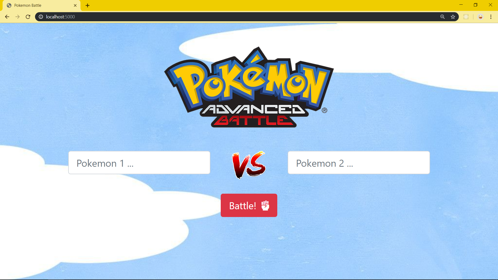
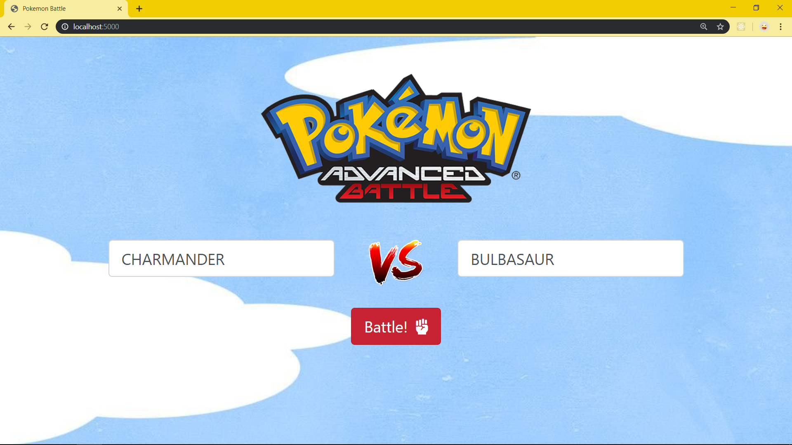
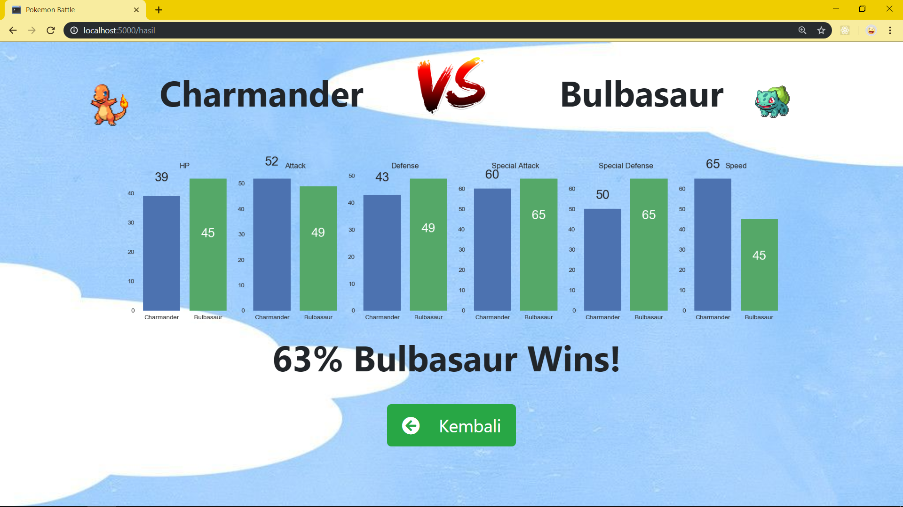
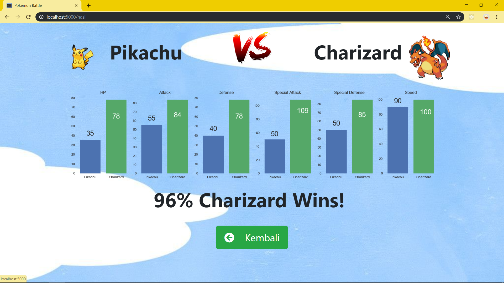
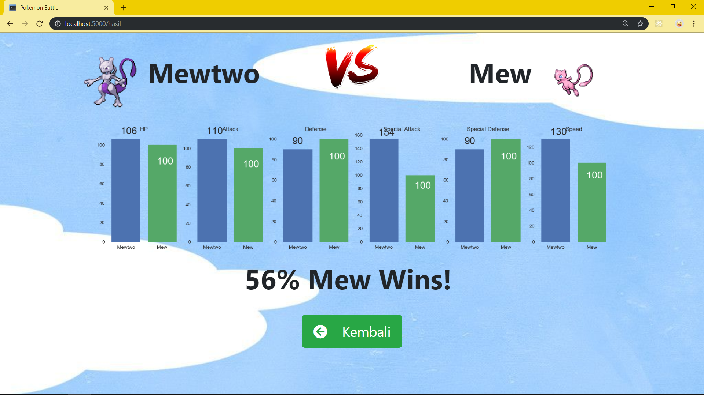

# Machine Learning Exam


### **Soal 1 - Diagnosis Kesuburan**

Disediakan __1 buah dataset__ (*fertility.csv*) yang menunjukkan kondisi fisik, kebiasaan & rutinitas sehari-hari beberapa pasien wanita, berkaitan dengan tingkat kesuburannya. Unduh dataset dari repo ini: [klik sini](./Dataset_Soal_1) atau langsung dari sumbernya: [klik sini](https://www.kaggle.com/gabbygab/fertility-data-set).

Dari dataset tersebut buatlah sebuah __file python__ yang mengandung __3 buah algoritma model machine learning__ (pilihan model bebas), kemudian buatlah prediksi diagnosis kesuburan terhadap profil wanita berikut berdasarkan 3 model yang Anda pilih:

- 👩‍🔧 __Arin (*Montir, 29 th*)__
    
    Sejak kecil terkenal sehat & lincah, tak pernah mengalami penyakit serius. Usai menjadi Sarjana Teknik, Arin meneruskan usaha bengkel ayahnya. Setiap hari menghabiskan 5 jam untuk duduk, sembari merokok & mengkonsumsi alkohol.

- 👩‍🍳 __Bebi (*Chef, 31 th*)__

    Memutuskan fokus menggeluti bidang kuliner setelah 10 tahun yang lalu kakinya terpaksa diamputasi lantaran kecelakaan lalu lintas. Tidak merokok namun dalam seminggu beberapa kali mengkonsumsi alkohol.

- 👩‍🌾 __Caca (*Gardener, 25 th*)__

    Pecinta lingkungan yang terobsesi dengan gaya hidup sehat. Sayangnya daya tahan tubuhnya lemah. Sedari kecil hingga kini, Caca kerap kali terjangkit penyakit, terutama batuk, pilek & demam. Dalam sehari, 7 jam ia habiskan untuk duduk.

- 👩‍🎓 __Dini (*Dosen, 28 th*)__

    Dosen muda ini 2 bulan lalu baru saja menjalani operasi patah tulang rusuk, akibat cedera saat berolahraga. Kini ia terpaksa duduk di kursi roda, selama masih dalam masa penyembuhan hingga 1 bulan ke depan. Setiap hari Dini merokok, namun sangat anti pada alkohol.

- 👩‍⚕ __Enno (*Dokter, 42 th*)__

    Semasa kecil, Enno kerap kali terjangkit asma akut. Bahkan pernah menjalani perawatan intensif akibat _bronkitis_. Kini sebagai dokter umum, ia senantiasa menjaga kebersihan & kesehatan. Dalam sehari, 8 jam ia habiskan untuk melayani konsultasi pasien di poli umum.

Output yang diharapkan hanya menampilkan di _terminal_, prediksi diagnosis terhadap 5 profil wanita di atas menurut 3 algoritma model machine learning yang Anda pilih. Misal:

```bash
Arin, prediksi kesuburan: NORMAL (Lasso Regression)
Arin, prediksi kesuburan: NORMAL (K-Nearest Neighbors)
Arin, prediksi kesuburan: NORMAL (Extreme Random Forest)
... 
```

✅ _Commit & push source code jawaban soal ini ke __Github__ Anda, buatlah repo dengan nama __Diagnosis_Kesuburan__. Kemudian lampirkan __url link repo Github__ Anda via email ke lintang@purwadhika.com!_

#

### **Soal 2 - Rekomendasi Buku Bagus**

Disediakan __beberapa dataset__ seputar buku populer beserta ratingnya. File **_books.csv_** berisi data lengkap 10.000 buku populer di dunia, sedangkan file _**ratings.csv**_ berisi data user yang memberikan rating (_1 sampai 5_) terhadap buku-buku populer. Unduh dataset dari repo ini: [klik sini](./Dataset_Soal_2) atau langsung dari sumbernya: [klik sini](https://github.com/zygmuntz/goodbooks-10k).

Dari dataset tersebut buatlah sebuah __*content-based filtering recommender system*__ yang dapat memberikan __*5 rekomendasi buku*__ terhadap beberapa _history_ user berikut:

- 👨‍🔧 __Andi (*Montir, 30 th*)__

    Judul buku yang pernah dibaca | Rating yang diberikan
    -----|-----
    The Hunger Games | ⭐⭐⭐⭐⭐
    Catching Fire | ⭐⭐⭐⭐⭐
    Mockingjay | ⭐⭐⭐⭐
    The Hobbit or There and Back Again | ⭐⭐⭐⭐
    Animal Farm: A Fairy Story | ⭐

- 👨‍🍳 __Budi (*Chef, 23 th*)__

    Judul buku yang pernah dibaca | Rating yang diberikan
    -----|-----
    Harry Potter and the Philosopher's Stone | ⭐⭐⭐⭐⭐
    Harry Potter and the Chamber of Secrets | ⭐⭐⭐⭐⭐
    Harry Potter and the Prisoner of Azkaban | ⭐⭐⭐⭐⭐
    
- 👨‍🌾 __Ciko (*Gardener, 26 th*)__

    Judul buku yang pernah dibaca | Rating yang diberikan
    -----|-----
    The Brightest Star in the Sky | ⭐⭐
    The Last Seven Months of Anne Frank | ⭐
    The Venetian Betrayal | ⭐⭐
    Robots and Empire | ⭐⭐⭐⭐⭐

- 👨‍🎓 __Dedi (*Dosen, 40 th*)__

    Judul buku yang pernah dibaca | Rating yang diberikan
    -----|-----
    Nine Parts of Desire: The Hidden World of Islamic Women | ⭐⭐⭐⭐
    "A History of God: The 4,000-Year Quest of Judaism, Christianity, and Islam" | ⭐⭐⭐⭐⭐
    "No god but God: The Origins, Evolution, and Future of Islam" | ⭐⭐⭐⭐
    Hunter × Hunter #1 | ⭐ 
    Peter Pan | ⭐⭐

- 👨‍⚕ __Ello (*Doctor, 35 th*)__

    Judul buku yang pernah dibaca | Rating yang diberikan
    -----|-----
    Being Mortal: Medicine and What Matters in the End | ⭐⭐ 
    George's Marvellous Medicine | ⭐⭐
    Doctor Sleep | ⭐⭐⭐⭐
    The Story of Doctor Dolittle | ⭐⭐⭐⭐⭐
    Bridget Jones's Diary | ⭐⭐⭐⭐⭐

Output yang diharapkan hanya menampilkan di _terminal_, __*5 rekomendasi buku*__ terhadap 5 profil user di atas berdasarkan _content-based filtering_. Misal:

```bash
1.  Buku bagus untuk Andi:
    - The Hunger Games Box Set
    - Harry Potter and the Philosopher's Stone
    - Harry Potter and the Chamber of Secrets
    - The Da Vinci Code
    - Harry Potter and the Order of the Phoenix

... 
```

✅ _Commit & push source code jawaban soal ini ke __Github__ Anda, buatlah repo dengan nama __Rekomendasi_Buku_Bagus__. Kemudian lampirkan __url link repo Github__ Anda via email ke lintang@purwadhika.com!_

#


### **Soal 3 - Pokemon Battle**

Disediakan __beberapa dataset__ seputar data spesies Pokemon beserta history pertandingan antar Pokemon. File **_pokemon.csv_** berisi data lengkap 800 spesies Pokemon, sedangkan file _**combats.csv**_ berisi data historis duel Pokemon beserta pemenangnya. Unduh dataset dari repo ini: [klik sini](./Dataset_Soal_3) atau langsung dari sumbernya: [klik sini](https://www.kaggle.com/sekarmg/pokemon).

Dengan dataset tersebut, buatlah sebuah __aplikasi Flask__ berisi model machine learning (model bebas) yang dapat memprediksi pemenang dari duel Pokemon. Aplikasi yang dibuat harus memenuhi syarat minimal berikut:

1. Server aplikasi akan berjalan di __localhost:5000__ dan ketika user melakukan GET request via browser akan tampil sebuah halaman __HTML__ sederhana yang memuat __2 buah text input__ dan __1 buah button__. Desain tampilan HTML tidak harus sama seperti contoh soal, utamakan fitur!

    

2. User dapat memasukkan nama Pokemon yang akan dipertandingkan ke dalam text input yang tersedia. Saat user menekan tombol button __'Battle!'__, aplikasi akan memproses data yang telah diinputkan oleh user.

    

3. Jika data sukses diproses, maka user akan di-_redirect_ ke __localhost:5000/hasil__ berisi halaman __HTML__ yang menampilkan: 
    
    - __Gambar Pokemon__
        - gunakan __Poke API__ ([_klik sini_](https://pokeapi.co/))
        - __GET__ ke https://pokeapi.co/api/v2/pokemon/{nama_Pokemon}

    - __Grafik perbandingan skill Pokemon__ (dari dataset): 
        - HP, 
        - Attack 
        - Defense 
        - Special Attack
        - Special Defense 
        - Speed

    - __Kemungkinan pemenang__ beserta __% probabilitasnya__

    Halaman ini juga dilengkapi __1 buah button__ untuk kembali ke halaman awal. Desain tampilan HTML tidak harus sama seperti contoh soal, utamakan fitur! Contoh:

    -   __Charmander vs Bulbasaur__ 

        

    -   __Pikachu vs Charizard__ 

        

    -   __Mewtwo vs Mew__ 

        
    
4. Namun jika data tidak ditemukan atau tidak ada di dalam dataset, maka user akan di-redirect ke halaman __HTML__ yang memberikan informasi bahwa data tidak ditemukan. Halaman ini juga dilengkapi __1 buah button__ untuk kembali ke halaman awal. Desain tampilan HTML tidak harus sama seperti contoh soal, utamakan fitur!

    

_**Catatan:**_

⚠ Poke API memiliki batasan __100 API request per IP address per menit__. Jika Anda mengalami kendala dikarenakan telah mencapai limit, maka tunggulah sejenak beberapa menit, lalu coba call API kembali.

✅ _Commit & push source code jawaban soal ini ke __Github__ Anda, buatlah repo dengan nama __Pokemon_Battle__, kemudian lampirkan __url link repo Github__ Anda via email ke lintang@purwadhika.com!_


#

### *__#HappyCoding__* :relaxed:

#### Lintang Wisesa :love_letter: _lintangwisesa@ymail.com_

[Facebook](https://www.facebook.com/lintangbagus) | 
[Twitter](https://twitter.com/Lintang_Wisesa) |
[Google+](https://plus.google.com/u/0/+LintangWisesa1) |
[Youtube](https://www.youtube.com/user/lintangbagus) | 
:octocat: [GitHub](https://github.com/LintangWisesa) |
[Hackster](https://www.hackster.io/lintangwisesa)